<!-- _paginate: false -->
<!-- _header: ""-->
<!-- _footer: "" -->

# Adaptação do artigo "Hand Gesture Recognition based on Shape Parameters" by Meenakshi Panwar

&nbsp;
&nbsp;

**Ana Beatriz Pontes**
**Hyago Gabriel Figueiredo**

---

# Artigo base

- Sistema em tempo real para reconhecimento de gestos de mão
- Objetivo: reconhecer gestos de mão para gerar comandos para um computador

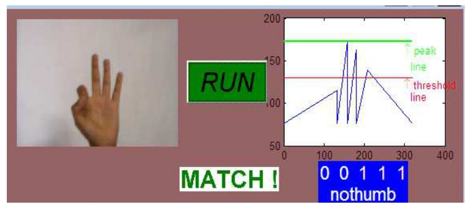

---

# Metodologia - artigo base

- Fórmulas usadas:
  &nbsp;
  $$M_{ij} = \sum_x\sum_y x^i y^j I(x,y)$$
  $$E.D(a,b)=\sqrt{(x_a - x_b)^2 + (y_a - y_b)^2}$$

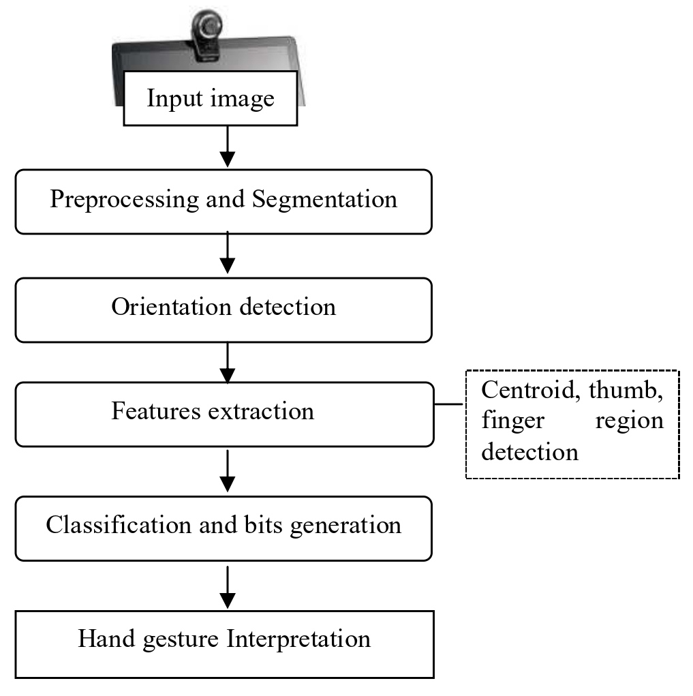

---

#### Passo a passo do artigo base

&nbsp;

- Segmentação K-means
- Preenchimento de buracos

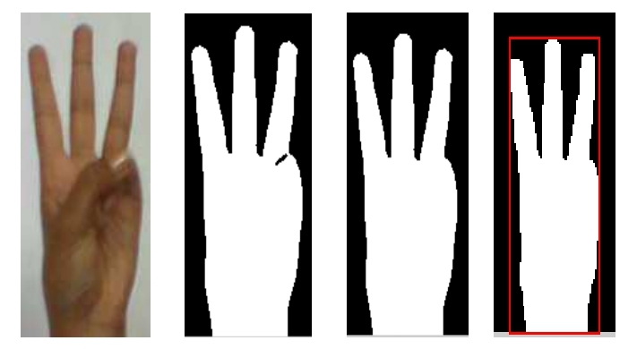

---

    

- Detecção de orientação
- Detecção de pontos de interesse
- Rotação da imagem

Identificação|Dimensões
:------------------------------------:|:---------------------:
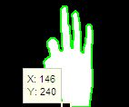 | 
 | 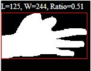

---

- Detecção do polegar
- Idenificação de picos a aprtir do centroide da imagem

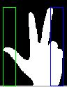
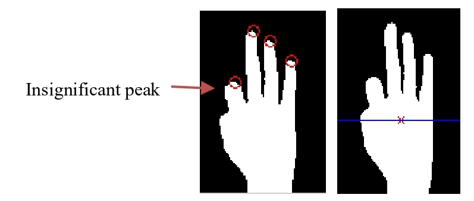

---

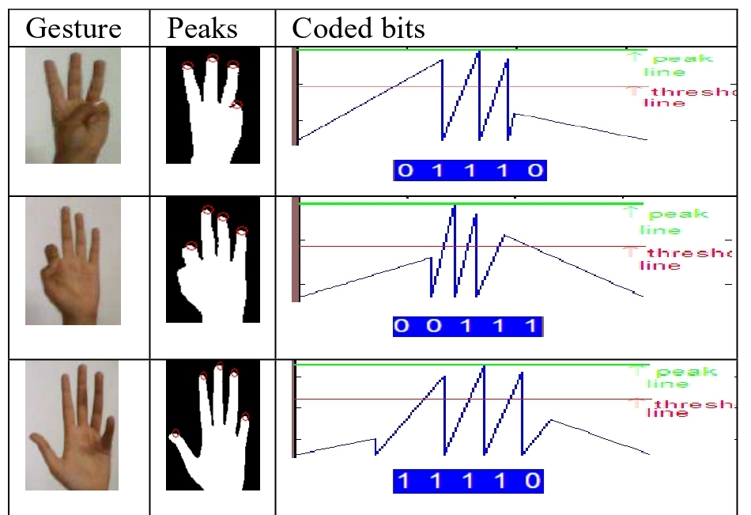

# Resultados - artigo base

- Gera uma sequencia de bits binários
- Compara com uma base de dados
- Classifica o gesto

---

# Nossa metodologia

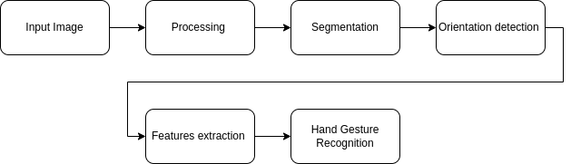

---

# Resultados

- Exemplo de resultado assertivo

**_Legenda dos pontos:_**
Cor|Significado
:---:|:---:
🔴 | Todos os possíveis pontos
🟡 | Pontos cotados como topo
🟢 | Resultado para máximos locais

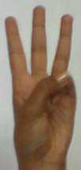 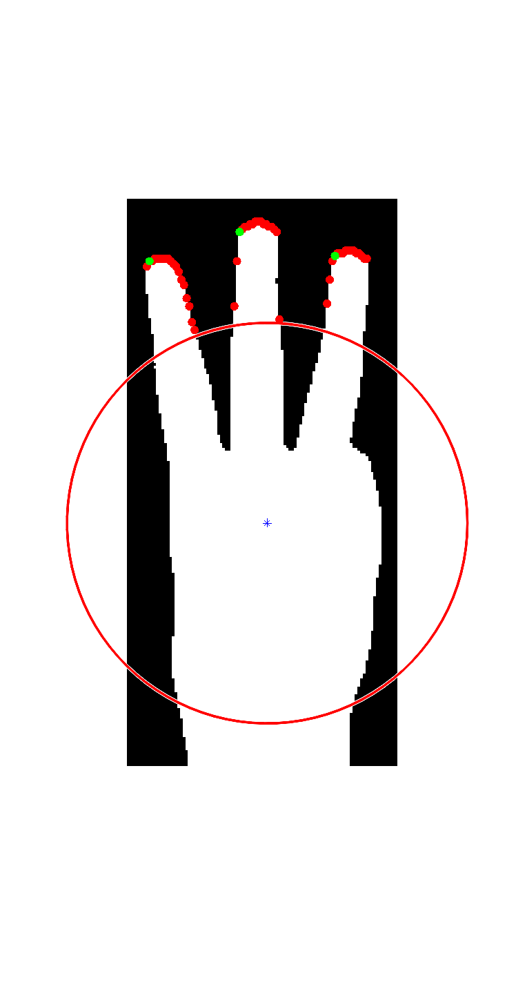

---

# Resultados

- Exemplo de resultado incerto

**_Legenda dos pontos:_**
Cor|Significado
:---:|:---:
🔴 | Todos os possíveis pontos
🟡 | Pontos cotados como topo
🟢 | Resultado para máximos locais

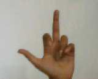 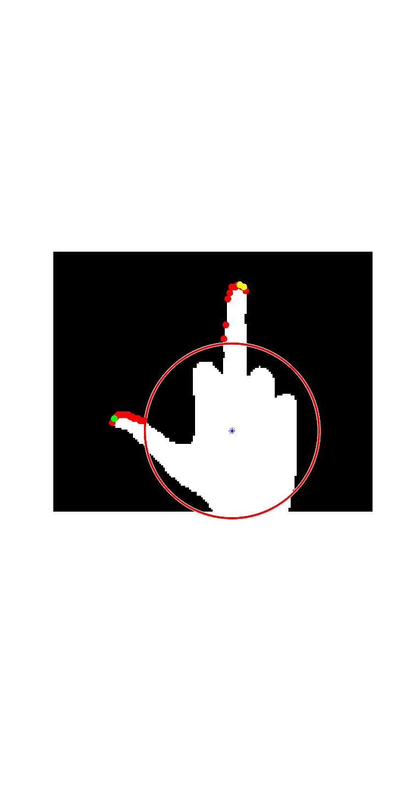

---

# Resultados

- Exemplo de resultado não satisfatório

**_Legenda dos pontos:_**
Cor|Significado
:---:|:---:
🔴 | Todos os possíveis pontos
🟡 | Pontos cotados como topo
🟢 | Resultado para máximos locais

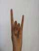 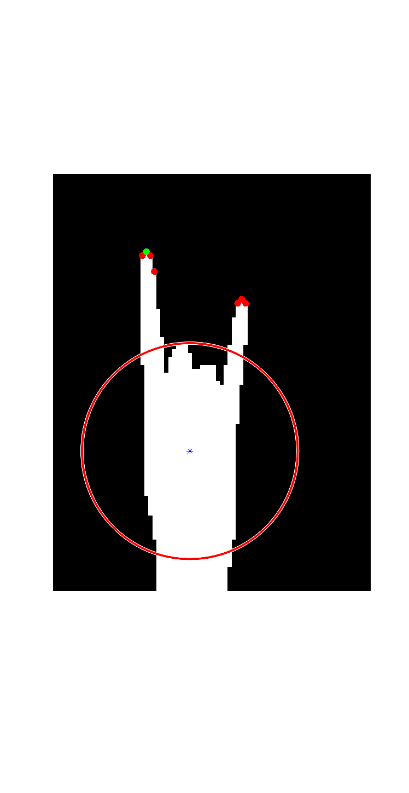

---

# Conclusões

<!-- _paginate: false -->
<!-- _header: ""-->
<!-- _footer: "" -->

- Desafios encontrados
- Diferenças de resultados entre o artigo base e a nossa metodologia
- Pontos similares entre os resultados
- Possíveis melhorias

---

# Referencias

<!-- _paginate: false -->
<!-- _header: ""-->
<!-- footer: " " -->

- Meenakshi Panwar and Pawan Singh Mehra , “Hand Gesture Recognition
  for Human Computer Interaction”
- Amornched Jinda-apiraksa, Warong Pongstiensak, and Toshiaki Kondo,
  ”A Simple Shape-Based Approach to Hand Gesture Recognition”
- A. Jinda-Apiraksa, W. Pongstiensak, and T. Kondo, “Shape-Based Finger
  Pattern Recognition using Compactness and Radial Distance”
- Rajeshree Rokade , Dharmpal Doye, Manesh Kokare, “Hand Gesture
  Recognition by Thinning Method”

---
<!-- _paginate: false -->
<!-- _footer: "Imagem de agradecimento retirada dos slides do Professor Pedro Garcia. Fonte: https://github.com/pedrogarciafreitas" -->

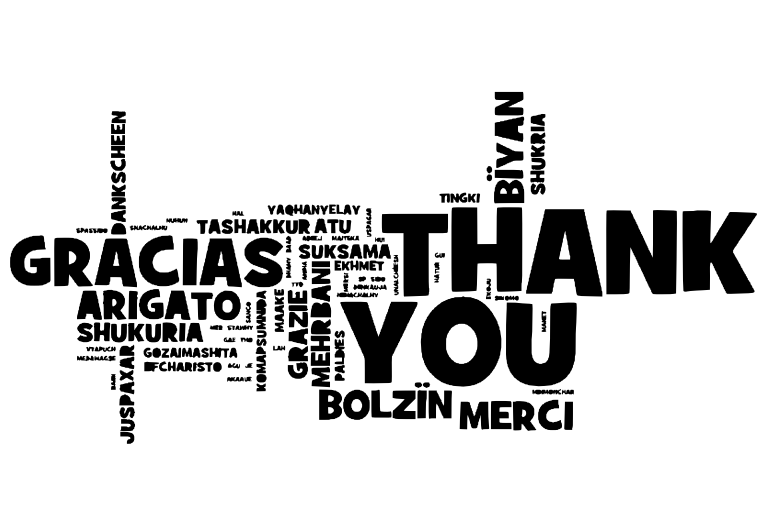
